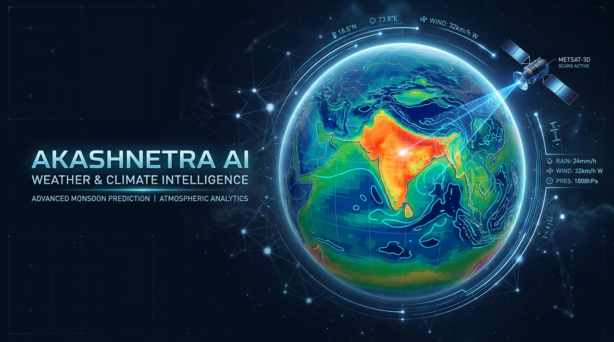
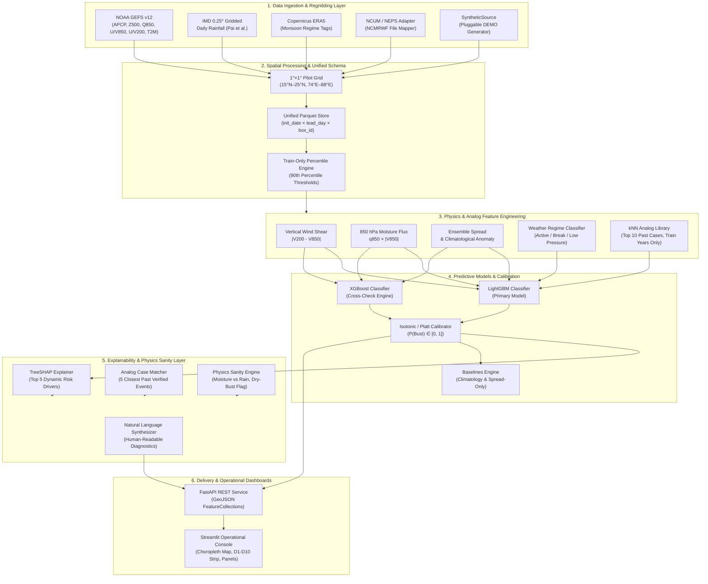

<div align="center">



# 🛰️ आकाशनेत्र AI (AkashNetra AI)
### *Next-Generation NWP Post-Processing & Forecast Bust Predictor*
**Smart India Hackathon 2026 Submission | Atmospheric & Climate Intelligence**

[](https://www.python.org/)
[](https://fastapi.tiangolo.com/)
[](https://streamlit.io/)
[](https://lightgbm.readthedocs.io/)
[](https://shap.readthedocs.io/)
[](LICENSE)
[]()

<br/>


<br/>

*“AkashNetra” (Celestial Eye) is an operational post-processing intelligence layer that sits downstream of Numerical Weather Prediction (NWP) systems (IMD/NCMRWF NCUM & NEPS, NOAA GEFS v12). It estimates, for every 1°×1° spatial box across lead days 1–10, the probability of a severe rainfall forecast bust (errors in the top 10% of historical forecasts) — accompanied by SHAP physical drivers, historical analog cases, and meteorological sanity checks.*

> ⚠️ **Disclaimer:** *AkashNetra AI is an analytical research prototype for NWP uncertainty estimation; it does not replace official meteorological agency alerts or operational IMD bulletins.*

</div>

---

## 📌 Executive Summary

Numerical Weather Prediction (NWP) models have advanced dramatically, yet convective precipitation forecasts over the Indian subcontinent remain prone to severe localized failures ("busts"). When high-impact rainfall events are missed, or false alarms trigger unnecessary evacuations, public safety and disaster response suffer.

**AkashNetra AI does not attempt to simulate weather physics from scratch.** Instead, it treats the numerical model itself as an imperfect sensor and acts as an intelligent supervisor:
1. **Monitors** 24-hour accumulated rainfall forecasts across Lead Days 1 to 10.
2. **Evaluates** atmospheric stability, dynamics, and ensemble spread anomalies.
3. **Predicts** whether the numerical forecast will fail catastrophically (Bust Probability).
4. **Explains** root causes using TreeSHAP attribution, nearest-neighbor historical analogs, and transparent physical rules.

---

## 📐 The Bust Definition

A **forecast bust** is defined using a **leakage-controlled** methodology:

$$\text{Error}(d, t, b) = \left| \overline{R}_{\text{fcst}}(d, t, b) - R_{\text{obs}}(t+d, b) \right|$$

$$T(b, d, \text{season}) = \max\left( Q_{0.90}(b, d, \text{season}), \epsilon_{\text{floor}} \right)$$

$$\text{Bust}(d, t, b) = \begin{cases} 1 & \text{if } \text{Error}(d, t, b) > T(b, d, \text{season}) \\ 0 & \text{otherwise} \end{cases}$$

Where:
* **Spatial unit ($b$):** $1^\circ \times 1^\circ$ grid cells over the pilot region (Central India: $15^\circ\text{N} - 25^\circ\text{N}$, $74^\circ\text{E} - 88^\circ\text{E}$, 140 boxes).
* **Lead day ($d$):** Lead times $d \in \{1, 2, \dots, 10\}$ (24 h accumulated rainfall).
* **Forecast:** Ensemble-mean 24 h accumulated rainfall $\overline{R}_{\text{fcst}}$.
* **Observation:** IMD $0.25^\circ$ gridded daily rainfall regridded conservatively to $1^\circ \times 1^\circ$.
* **Threshold Computation:** The 90th percentile threshold $Q_{0.90}(b, d, \text{season})$ is computed per box $b$ and per lead day $d$ **strictly on training years only** and frozen into an artifact. It is applied unchanged to validation and test years.
* **Minimum-Error Floor ($\epsilon_{\text{floor}}$):** An absolute error floor (default $5.0\text{ mm}$) ensures that trivial errors in dry boxes or low-rain conditions are not classified as high-impact busts.
* **Expected Base Rate:** By construction, ~10% of training samples are busts, establishing a random predictor baseline of $\text{PR-AUC} \approx 0.10$.

---

## 🏛️ System Architecture



---

## 🔬 Core Meteorological & ML Features

| Feature Class | Parameter | Meteorological / Analytical Rationale |
|---|---|---|
| **Ensemble Uncertainty** | `spread_mm`, `spread_anom` | Standard deviation across ensemble members relative to box climatological spread. |
| **Moisture Dynamics** | `moisture_flux_850` | $q_{850} \times |\mathbf{V}_{850}|$ — indicates low-level moisture convergence feeding monsoon depressions. |
| **Kinematic Shear** | `wind_shear_200_850` | $|\mathbf{V}_{200} - \mathbf{V}_{850}|$ — critical for deep organized convective storm maintenance. |
| **Synoptic Heights** | `z500_anom`, `t2m_anom` | Mid-tropospheric trough/ridge anomalies influencing monsoon trough oscillations. |
| **Monsoon Regimes** | `regime_tag` | Rule-based categorical indicator of Active vs. Break monsoon phases. |
| **Analog Memories** | `analog_bust_rate`, `analog_mean_error` | Fraction of $k=10$ nearest historical forecasts (same lead day, training years only) that resulted in busts. |

---

## 🛡️ Anti-Leakage & Honesty Guarantees

* **Strict Year Splits:** Chronological year blocks:
  * Full mode: `Train: 2000–2014`, `Val: 2015–2016`, `Test: 2017–2019`.
  * Dev mode: `Train: 2015–2017`, `Val: 2018`, `Test: 2019`.
* **Zero Contamination in Analogs:** The historical analog retrieval library only searches historical cases from training years. A dedicated automated unit test enforces that no validation or test year ever enters the analog memory index.
* **Transparent Synthetic Attribution:** When running in demonstration mode without local GRIB/NetCDF real observations, all responses and visualizations display a clear **"SYNTHETIC DEMO DATA"** badge (`data_mode: "synthetic"`).

---

## 📂 Project Directory Structure

```text
akashnetra/
├── .streamlit/
│   └── config.toml               # Modern weather-service light theme configuration
├── configs/
│   └── ncum_variable_map.yaml    # Mapping schema for NCMRWF NCUM/NEPS NetCDF/GRIB2 files
├── docs/
│   ├── assets/                   # High-resolution branding, logo, and diagrams
│   ├── ARCHITECTURE.md           # In-depth architectural decisions and rationale
│   └── DATA_NOTES.md             # Programmatic audit log of remote data sources
├── scripts/
│   ├── tasks.py                  # Cross-platform task runner (Make alternative for Windows)
│   ├── run_demo.py               # End-to-end synthetic demo pipeline
│   ├── download_data.py          # Data ingestion script for GEFS/IMD/ERA5
│   ├── build_dataset.py          # Regridding, QC, and unified feature generation
│   └── train.py                  # Model training, isotonic calibration, and evaluation
├── src/akashnetra/
│   ├── config.py                 # Strictly typed Pydantic configuration loader
│   ├── logging_setup.py          # Clean, uniform logging with secret redaction
│   ├── runinfo.py                # Environment fingerprinting (Git hash, versions, seeds)
│   ├── ingest/                   # Source adapters (GEFS, IMD, ERA5, NCUM, Synthetic)
│   ├── processing/               # Spatial regridding, QC filters, 1° box generator
│   ├── features/                 # Physics derivations, regime tags, kNN analogs
│   ├── models/                   # LightGBM, XGBoost, Calibrators, Baselines, CNN stub
│   ├── explain/                  # TreeSHAP, physics rule checks, plain-language text
│   ├── api/                      # FastAPI endpoints returning GeoJSON FeatureCollections
│   └── dashboard/                # Operational Streamlit console and components
├── tests/                        # Comprehensive pytest test suite (34 unit & regression tests)
├── .env.example                  # Environment secrets template
├── .gitignore                    # Robust gitignore (protects large data & artifacts)
├── config.yaml                   # Central project configuration
├── Dockerfile.api                # Container definition for FastAPI backend
├── Dockerfile.dashboard          # Container definition for Streamlit dashboard
├── docker-compose.yml            # Multi-service local orchestrator
├── Makefile                      # Standard CLI targets
└── pyproject.toml                # Project packaging and tool configuration
```

---

## ⚡ Quickstart Guide

### 1. Environment Setup

```bash
# Clone the repository
git clone https://github.com/adixists/AkashNetra-AI.git
cd AkashNetra-AI

# Create and activate virtual environment
python -m venv .venv
# On Windows:
.\.venv\Scripts\activate
# On Linux/macOS:
source .venv/bin/activate

# Install dependencies and editable package
pip install -r requirements.txt -r requirements-dev.txt
pip install -e . --no-deps
```

### 2. Verify Installation & Run End-to-End Demo

```bash
# Run pytest verification suite (all 34 tests pass out of the box)
python scripts/tasks.py test

# Check code formatting & linting
python scripts/tasks.py lint

# Run Milestone M1 End-to-End Synthetic Demo (generates 854k rows + train thresholds)
python scripts/tasks.py demo
```

*(On Linux / macOS systems with `make` installed, you can simply run `make test`, `make lint`, and `make demo`)*

---

## 📊 Milestone Roadmap

| Milestone | Deliverables | Status |
|:---:|:---|:---:|
| **M0** | Repository scaffold, typed config validation, logging, cross-platform tooling, Docker skeleton | **COMPLETED ✅** |
| **M1** | Synthetic DEMO MODE source generator, 1°×1° box grid, conservative regridding, QC filter, train-only 90th percentile bust labeller with minimum-error floor, leakage-controlled evaluation | **COMPLETED ✅** |
| **M2** | Physics features (shear, moisture flux anomaly), kNN analog library, LightGBM/XGBoost, isotonic calibration, baseline comparisons | **COMPLETED ✅** |
| **M3** | TreeSHAP driver attribution, historical case evidence, meteorological sanity checks, reason generator | **COMPLETED ✅** |
| **M4** | FastAPI endpoints serving standards-compliant GeoJSON alert collections | **COMPLETED ✅** |
| **M5** | Streamlit operational console (interactive choropleth, D1–D10 tiles, diagnostic breakdown) | *In Progress 🔄* |
| **M6** | Real-world GEFS v12 reforecast ingestion & IMD gridded observation pipeline | *Upcoming ⏳* |
| **M7** | Multi-container Docker deployment, system hardening, and final verification | *Upcoming ⏳* |

---

## 👥 Contributors & Acknowledgements

* Developed for the **Smart India Hackathon 2026**
* Atmospheric data references: **IMD Daily Gridded Rainfall** (*Pai et al., 2014*), **NOAA GEFS v12 Reforecast Archive** (*Guan et al., 2022*), and **ECMWF Copernicus CDS ERA5 Reanalysis**.

---

<div align="center">
<sub>Crafted with scientific rigor & honest machine learning practices.</sub>
</div>
