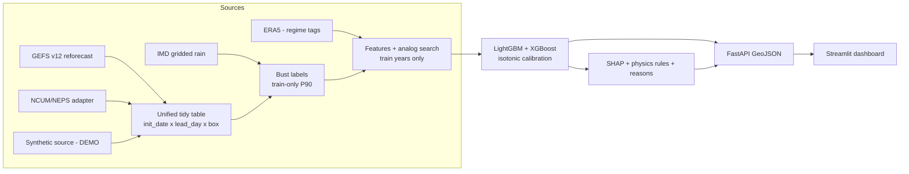

# Architecture

AkashNetra AI is an **add-on** that runs after an NWP forecast. It does not forecast
weather; it estimates the probability that the rainfall forecast for a 1°×1° box and lead
day (1-10) will be badly wrong ("bust"), and explains why.

## Design decisions (living list)

| Decision | Why |
|---|---|
| Thresholds computed on train years only, stored as an artifact | Prevents leakage into val/test |
| Bust threshold per (box, lead day) within the season with minimum-error floor (`bust.per_lead_day: true`, `bust.min_error_floor_mm: 5.0`) | Errors grow with lead, so per-lead thresholds prevent long leads from dominating bust counts. The minimum floor prevents trivial errors in dry or low-rain conditions from triggering false busts. |
| Season assigned by init date | A forecast issued 30 Sep stays in JJAS even if it verifies in October |
| No automatic fallback from real to synthetic data | Honesty rule; `data_mode` is explicit and surfaced in API/UI |
| Dev split 3/1/1 years vs full 15/2/3 | Proportional scaling for the 5-year dev subset; see `config.yaml` |
| `scripts/tasks.py` behind the Makefile | Windows machines often lack `make` |

Detail for each module is added as its milestone lands.
